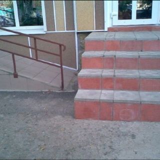
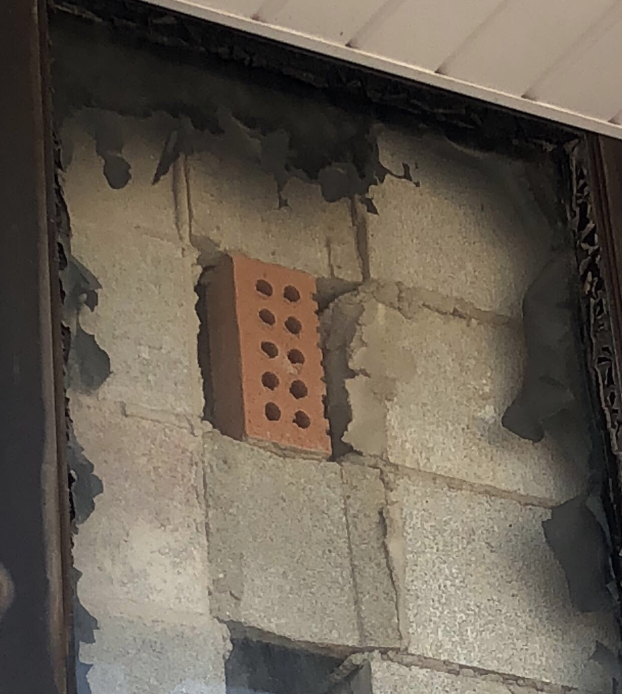
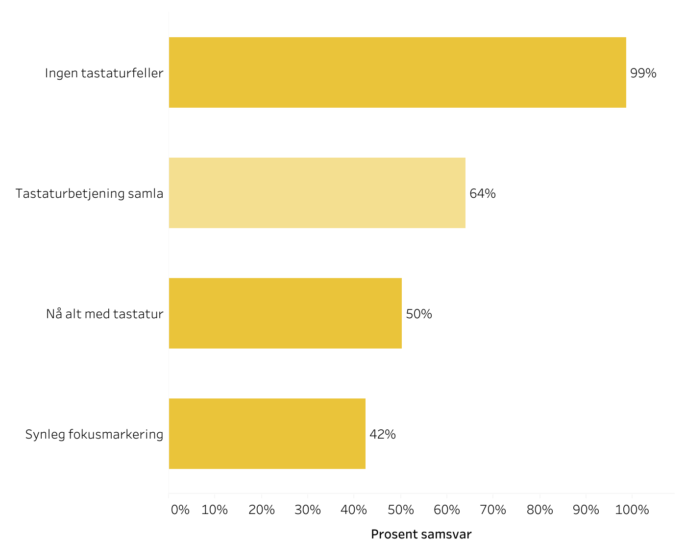

# Hva er universell utforming

* Universell utforming (uu) er et sett med krav om tilgjengelighet som norske IKT-løsninger må oppfylle.
* Alle krav fra DIFI stammer fra W3C sin [WCAG spesifikasjon for tilgjengelighet](http://www.w3.org/TR/WCAG20/). 
* Lovfesta krav er utvalgte A og AA krav, ingen AAA-krav er lovfesta.
 

## Datoer

* Løsninger med betydelig oppdatering etter 1. juli 2014  må oppfylle kravene.
* Alle løsninger rettet mot norsk almennhet må oppfylle kravene innen 1. Januar 2021.
* Nye krav fra oppdatert WCAG vil komme i lovverket <span style="text-decoration: line-through;"> ila første halvdel av 2019</span>

## Konsekvens

* Det er dyrt å ikke følge kravene. [SAS var nære å få dagbøter på 150 000,-](https://uu.difi.no/nyhet/2018/08/sas-norge-ilagt-tvangsmulkt)


# Hvorfor universell utforming


## Hvorfor universell utforming

* Mellom 15 og 18 prosent av norsk befolkning har nedsatt funksjonsevne.
* Eksempler være det å ha svakt syn, være døv, ukontrollert skjelving, lammelse osv.
* Selvbetjenging gjennom IT-løsninger.
* Nøvendig for noen, bra for alle.


## Begreper

* __Nettside__: En enkelt side på et nettsted.
* __Nettsted__: En samling av nettsider.
* __Nettløsning__: Formidling av informasjon eller tjeneste som er tilgjengelig i nettleser eller tilsvarende.
* __UI-komponent__ : Element på en side som er en del av grensesnittet, feks et tekstfelt. 
* __Tvangsmulkt__: Fungerer som en bot, straffen DIFI har for å kunne piske nettløsninger.


## 4 prinsipper

* Oppfatte
* Betjene
* Forstå
* Robust

 

# 1.x: Oppfatte


 
## 1.1 Tekstlig alternativ


 
### 1.1.1 Ikke-tekstlig innhold

* Tekstlig alternativ for alt ikke-tekslig innhold.
* Ikke-tekslig innhold må beskrives i markup.
* Inndata-elemener må kunne brukes av blinde.
* Rent dekorativt ikke-tekstlig innhold er unntatt.
 

## 1.2 Tidsbaserte medier
 
### 1.2.1 Bare lyd og bare video 
* Ren lyd må ha et tekstlig alternativ.
* Ren video må ha et tekst- eller lyd-alternativ. Et evt lyd-alternativ krever videre tekst-alternativ

### 1.2.2 Teksting
* Video med lyd må ha teksting

 
## 1.3 Mulig å tilpasse
 

 
### 1.3.1 Informasjon og relasjoner 
* Kode skal kunne beskrive innholdet slik som det ser ut.
* Speielt opp mot tabeller, skjema, statusmeldinger og modaler. 

### 1.3.2 Meningsfylt rekkefølge 
* Informasjon på en nettside må følge en logisk rekkefølge i DOM.
* Riktig leserekkefølge må kunne oppfattes programatisk.

### 1.3.3 Sensoriske egenskaper 
* Informasjon må aldri være utelukkende visuell, eller utelukkende lyd-basert.
 

## 1.4 Mulig å skille
 
### 1.4.1 Bruk av farge 
* Farge skal ikke være alene om å formidle informasjon. Lenker og feilmeldinger.

### 1.4.2 Styring av lyd
* Gi brukeren mulighet til å stoppe eller pause lyd .

### 1.4.3 Kontrast
* Tekst må ha et kontrastforhold på minst 4.5:1 mot bakgrunnen.
* For å oppnå anbefalte krav er dette forholdet 7:1.

### 1.4.4 Endring av tekststørrelse
* Kunne zoome til 200% størrelse uten tap av innhold eller funksjon.

### 1.4.5 Bilder av tekst
* Ikke formidle tekslig info i form av bilde.

 

# 2.x: Betjene




 
## 2.1 Tastatur tilgjengelig

 
### 2.1.1 Tastatur 
* All funksjonalitet skal være tilgjengelig med bruk av utelukkende tastatur.

### 2.1.2 Ingen tastaturfeller
* Ingen komponent på en nettside skal kunne hindre fokus fra å gå til de andre komponentene på siden.
 

 
## 2.2 Nok tid

 
### 2.2.1 Justerbar hastighet 
* Tidsbegrensinger skal kunne justeres av bruker.

### 2.2.2 Pause, stopp, skjul 
* For bevegelse, rulling eller automatisk oppdatering av informasjon.
* Største utfordring: slidere
 

 
## 2.3 Anfall og fysisk reaksjon
 
### 2.3.1 Terskelverdi på glimt
* Innhold kan ikke blinke mer enn tre ganger i løpet av ett sekund.
 
 
## 2.4 Navigere
 
### 2.4.1 Omgå blokker
* Det må gå ann å omgå blokker som gjentas på flere sider.

### 2.4.2 Sidetitler
* Sider må ha titler som beskriver emne eller formål.

### 2.4.3 Fokusrekkefølge
* Fokus-rekkefølge skal følge en logisk flyt.

### 2.4.4 Formål med lenke
* Formålet med enhver lenke skal være tydelig i markup.

### 2.4.5 Flere måter
* Det finnes mer enn én måte å finne frem til en nettside.
 
### 2.4.6 Overskrifter og ledetekster
* Overskrifter og ledetekster beskriver emne eller formål.

### 2.4.7 Synlig fokus
* Fokusindikator for tastaturnavigering må være synlig.
 

# 3.x: Forstå


 
## 3.1 Leselig
 
 
### 3.1.1 Språk på siden
* Sidens innhold skal være på et naturlig språk.
* Språk på nettsider kan bestemmes programmatisk. Dette kan gjøres i `<html>` elementet.

```html
<html lang="nb">
	<head>...</head>
	<body>...</body>
</html>
```

### 3.1.2 Språk på deler av innhold
* Sørg for at innhold som har forskjellig språk fra resten av siden har markering av dette i koden.
 

 
## 3.2 Forutsigbar
 
 
### 3.2.1 Fokus
* Endring av fokus skal ikke gjøre betydelige endringer på siden, eller flytte fokus på en måte som kan desorientere.

```javascript
let element = document.getElementById('testID');
element.addEventListener('focus', () => { 
	alert("Infinite loop"); 
});
```

#### 3.2.2 Inndata
* Endring av innhold i input skal ikke gjøre betydelige endringer av kontekst.

### 3.2.3 Konsekvent navigering
* Navigasjon som gjentas på flere nettsider på et nettsted må følge lik rekkefølge på hver side.

### 3.2.4 Konsekvent identifikasjon
* Elementer med samme funksjonalitet skal utformes likt hver gang de brukes.

 
 
## 3.3 Input-assistanse
 
 
### 3.3.1 Identifikasjon av feil 
* Hvis en inndata-feil oppdages autmatisk så identifiseres inndata-feltet, og bruker får instruks om hvordan å rette feil. 

### 3.3.2 Ledetekster eller instruksjoner
* Det vises ledetekster eller instruksjoner når innholdet krever inndata fra brukeren.

### 3.3.3 Forslag ved feil
* Når feil oppdages automatisk så skal det gis instrukser til hvordan man kan rette feilen.

### 3.3.4 Forhindring av feil
* Gjelder inndata som medfører juridiske forpliktelser.
  * Reverserbarhet - Sendeprosesser kan reverseres.
  * Kontroll - Nettstedet som mottar data validerer at data er korrekt, og gir bruker mulighet til å rette evt feil.
  * Bekreftelse - Skal ikke forpliktes med uhell.
 


# 4.x: Robust



 
## 4.1 Kompatibel
 
 
### 4.1.1 Parsing
* Alle sider skal være uten store kodefeil.

### 4.1.2 Navn, rolle, verdi
* Alle komponenter har navn og rolle bestemt i koden.

```html
<section name="content" role="main">
	<h1>Trenger ikke navn</h1>
	<form aria-label="Kontaktskjema">
		<label id="email-label">E-post</label>
		<input 
			type="email" 
			name="email" 
			autocomplete="email"
			aria-labeledby="email-label"
			aria-required="true"
		/>
		<input 
			type="submit" 
			role="button" 
			name="Send" 
			aria-label="Send kontaktskjema"
		/> 
	</form>
</section>
<aside name="sidebar" role="complementary">...</aside>
```
 
 

# WAI-ARIA
## Web Accessibility Initiative - Accessible Rich Internet Applications


## Hva er ARIA

* Et sett med regler som skal gjøre opp for forskjellige implementasjoner i forskjellige nettlesere.
* Hjelper til å få tilgjengeliggjort dynamisk innhold, feks innhold fra AJAX og endringer i React-komponenter.
* Plugins har variabel støtte. Gravity Forms og Beaver Builder har god støtte, WooCommerce har variabel støtte. 


 
## ARIA-eksempel
 
 
Det er ikke nødvendig å alltid ha `<label>` elementer.

```html
<input 
	type="search" 
	name="q" 
	placeholder="Search query" 
	aria-label="Search through site content"
/>
```
 
 
## ARIA-Skjema
 
 
Skjema-feil


```html
<form>
	<label for="client-name">
		Ditt navn (påkrevd):
	</label>
	<input 
		type="text"
		name="Ditt navn" 
		autocomplete="name" 
		id="client-name" 
		aria-required="true" 
		aria-invalid="true"
		aria-described-by="name-status"
	>
	<div class="error" id="name-status" role="alert">
		Noe gikk galt
	</div> 
	<input 
		type="submit" 
		role="button" 
		name="Send inn skjema" 
		value="Send" 
	>
</form>
```
 


# Resultat av tilsyn

## Resultat - samlet

 
## Resultat - Navigasjon

 
## Resultat - Bruk av tastatur

 
## Resultat - Koding av innhold

 
## Resultat - Bruk av skjema

 
## Resultat - Alternativt format


## Hva er nytt i WCAG 2.1


 
# WCAG 2.1
 
 
* 17 nye krav, hvorav 12 er A eller AA
* Fokuserer mye på mobile enheter og inndata-enheter. 
* DIFI har ikke spesifisert hvilke krav som blir med i lovverket. 
 

 
### 1.3 Mulig å tilpasse
 
 
### 1.3.4 Orientasjon
* Ting skal kunne brukes, uansett om man bruker landscape eller portrait-modus på telefon/nettbrett. 

### 1.3.5
* Input-elementer skal ha autofill-tags

```html
<!-- Bytte passord -->
<input type="password"
	aria-label="Confirm your current password" 
	autocomplete="sm-change-password current-password">
<input type="password" 
	aria-label="Set a new password"
	autocomplete="sm-change-password new-password">
<input type="password" 
	aria-label="Confirm the new password" 
	autocomplete="sm-change-password new-password">

<!-- Logge inn -->
<input type="text" 
	autocomplete="sm-login username">
<input type="password" 
	autocomplete="sm-login current-password">
```
 
 
## 1.4  Mulig å tilpasse

### 1.4.10 Reflow (AA)
* Man skal ikke trenge å scroll'e i 2 retninger, selv om man zoomer inn til 400%

### 1.4.11 Non-Text Contrast (AA)
* Eksempel: ramme i form-elementer, kunne se at input-elementer faktisk er er input-elementer, som teksbokser og knapper.
* Kravet er kontrast-score på 3:1
 
### 1.4.12 Text Spacing (AA)

* Rekke krav som ikke skal miste noe innhold eller funksjonalitet:
  * Line height (line spacing) to at least 1.5 times the font size
  * Spacing following paragraphs to at least 2 times the font size
  * Letter spacing (tracking) to at least 0.12 times the font size
  * Word spacing to at least 0.16 times the font size.

### 1.4.13 Content on Hover or Focus (AA)

* Elementer som popper inn ved hover/focus må kunne: 
  * lukkes , uten å flytte peker/fokus
  * markeres med musepeker hvis innholdet er hover-basert
  * Vises frem til fokus/peker flyttes, eller at bruker lukker det.
 


 
## 2.1 Tastatur tilgjengelig
 
 
### 2.1.4 Character Key Shortcuts (A)

* Keyboard-shortcuts, hvis de bruker kun bokstaver (ikke feks shift+X) må være mulig å deaktivere
 
 
## 2.5 Input Modalities
Ny seksjon
 
 
### 2.5.1 Pointer Gestures (A)

* Elementer som krever at man bruker multi-punkt navigasjon, eller path-basert interaskjon trenger knapper for å gjenskape lik oppførsel

### 2.5.2 Pointer Cancellation (A)

* Det må være mulig å avbryte inn-klikk ved å dra seg unna elementet man klikket på for så å slippe.

### 2.5.3 Label in Name (A)

* name-attributten til elementer må være i naturlig språk, 
* eks: submit-knapper skal hete ting som "Send" eller "Bestill", ikke "Submit", slik at stemmeverktøy kan finne den.

### 2.5.4 Motion Actuation (A)

* Omhandler motion-gestures, som å riste eller snurre på enheten. Relevant for apper.
 


 
## 4.1 Kompatibel
 
 
### 4.1.3 Status Messages (AA)

* Bruke `role="status"` eller `role="error"` på elementer som gir tilbakemelding fra feks skjema, slik at skjermlesere vil lese de automatisk.
 

 
# Fremtiden
 
 
## EU's web-direktiv 
* Mye rart foregår i offentlige høringer for og mot innholdet i denne.
* Skal gjennomføres innen 01.07.2019, og så får løsningene 1 år på å implementere.

## WCAG 2.1 
* Det er ikke offentliggjort om noe som helst blir eksludert eller ikke.
* Det er ikke offentliggjort noen start-dato
 
